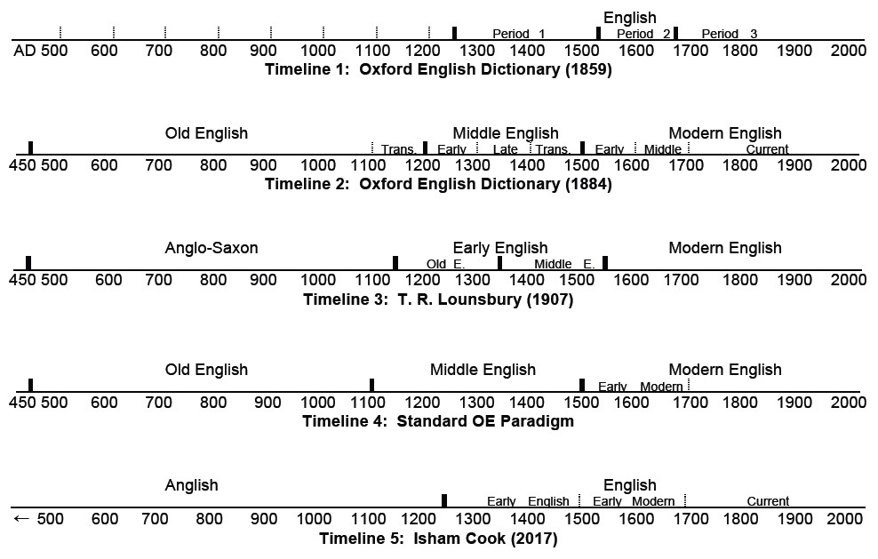

# Why English is 750 years old

Created: Jul 07, 2019 2:47 PM
URL: https://ishamcook.com/2017/02/12/why-english-is-750-and-not-1500-years-old/

Sample text of Anglish (Anglo-Saxon), circa AD 1000

How English arose is a captivating story with a great cast of characters, though they happen to be groups of people and texts rather than individuals. It emerges out of the mists seemingly from nowhere, flounders, and changes into something else, before finally catching wind and taking over the planet as the first truly global language. It’s also a story that’s been told and retold by many authors and scholars. And it increasingly appears that for the past 100 years most of those telling the story have gotten it wrong.

## The Celtic problem

Let’s begin at a starting point far enough back in time to take in the larger view, the situation of the British Isles some 2,000 years ago. One or two million Britons populated the land, scattered about in hamlets or homesteads, and the story goes, speaking various Celtic languages and dialects, about which there is much uncertainty as they were never written down. It’s assumed the Celts crossed over from the Continent in successive waves over the previous several centuries, bringing a new version of their language each time. The hostile tribes known as the Picts, for instance, who had been pushed up to northern Scotland by newly invading Celts, may have spoken an earlier form of Celtic. Collectively the Celtic tongues of Britain have been termed “Insular Celtic,” “Brittonic,” or simply “British,” to distinguish them from the Celtic on the Continent.

Here’s an example of what one of these languages looks like today, and what we might all be speaking if the Celts had managed to displace the Angles and the Saxons from England:

*Ein Tad yn y nefoedd, sancteiddier dy enw. Deled dy deyrnas; gwneler dy ewyllys, ar y ddaear fel yn y nef. Dyro inni heddiw ein bara beunyddiol. Maddau inni ein troseddau, fel yr ym ni wedi maddau i’r rhai a droseddodd yn ein herbyn. A phaid â’n dwyn i brawf, ond gwared ni rhag yr un drwg.*

You’ll recognize this as Welsh. Confined largely to mountainous pockets of Wales since the seventh century, the language was isolated and has thus experienced little structural change up until the present; some Welshman today claim to read Welsh text from 1,000 years ago with ease. Not that this has made it any friendlier to the English. In Shakespeare’s time, the language was considered so exotic the word itself signified any incomprehensible language, as when we say “it’s Greek to me.” It figures in the scene in Glyndwr’s castle in *1 Henry IV* (3.1) where Hotspur pokes fun at Mortimer’s inability to communicate with his non-English speaking wife other than sexually. What’s telling is that though the stage directions call for Welsh, no lines in Welsh are provided (whereas we do find a comparable scene of bawdy repartee with French text in *Henry V* 5.2). That Shakespeare’s company could have hired a native Welsh-speaking boy to play Lady Mortimer is clear from the stage direction, “The lady speaks in Welsh,” repeated five times, before she gets the spotlight to sing a Welsh song. As for lobbing an unintelligible language at the audience, Shakespeare deftly engages Mortimer in a conversation with Hotspur and Glyndwr at the same time, foregrounding the English. Whatever Welsh was spoken and sung might have been improvised on each occasion, or Shakespeare penned the lines himself before having them translated. Either way, the content put into Lady Mortimer’s mouth needn’t have had anything to do with the play. It could have been obscene jokes or insults directed at any Welshmen in the audience; there were surely a few (Queen Elizabeth reportedly could speak the language).

I make these points about Welsh to underscore the cultural divide in Britain between the western and northern Celtic-speaking regions and England itself, a divide present today and which goes back to prehistory.

Let’s go back to AD 43, when the Romans invaded Britannia. Now, there are three ways to take over a new territory. You can do it savagely, by “scorched earth” policy. This involves obliterating everything in your path: the enemy army, human habitations, livestock, and anything that moves and doesn’t as well, crops included. You burn it all to the ground and thereby prevent the defeated from ever regaining the ability to return and exact revenge, because they no longer exist (at least for a generation or two). This was the strategy used in, say, the Thirty Years’ War (1618-48), costing some eight million European lives, and the Taiping Rebellion (1850-64), costing ten times as many Chinese lives. It was pre-modernity’s version of nuclear war, and the outcome was far more destructive than any nuclear conflict yet in our time. The only problem with turning enemy land into a moonscape is that you destroy yourself as well, as there is no more food and no means of growing any fast enough before you starve. Another problem with scorched-earth warfare is that it wasn’t really possible before the introduction of firearms, ruling it out for the Romans and all subsequent invasions of Britain over the next thousand years (Jared Diamond, *Guns, Germs, and Steel*). Why then do I insert this implausibility into my narrative? It happens to be one of the theories in the standard account of the history of English, as we’ll see below.

A somewhat less ruthless and smarter method is androcide: wipe out the entire male enemy population while leaving women and agriculture intact (think Genghis Khan). This keeps the invading army happy, now that they have an infinite supply of females to rape and start families with, along with bread and beer. It pisses the hell out of the occupied population, however, necessitating their enslavement as the only way to exact their submission.

The third method is the wisest: symbolic punishment and reconciliation. You give them a slap on the wrist, put a mere few tens of thousands of the captured army to the sword, to convey the message you mean business. As long as they pay tribute to the conquerors the rest of the population is spared, and it’s business as usual. If you have superior technology, you can build on the existing infrastructure and develop it into something better. This is what the Romans did. They taught the Britons how to run their own country, and did such a good job at it that the mutually beneficial relationship lasted four centuries. The Romans’ presence is visible today in expressway routes following the elaborate highway system they built that crisscrossed the island, and thousands of Roman coins which continue to be found all over Britain, evidence of a vibrant ancient economy reaching into every corner of the land.

The language situation under Roman occupation was more complicated. The only way an invading army can succeed in replacing the existing language with their own is through complete displacement of the conquered population. This is not easy to do short of the scorched-earth treatment, which as we’ve seen destroys your own means of survival in the process. That’s why in virtually every case of invasion and occupation, the invaders remain in their linguistic bubble, or the reverse happens and inevitably outnumbered by the indigenous population, they end up speaking the local language. The Romans formed a Latin-speaking administrative class, while a bilingual class of traders, merchants, and locals wishing to benefit from the Roman presence sprouted up to interface between the Romans and the Britons.

Over the centuries, Latin vocabulary trickled down through the population, and the local languages were enriched with many Latin loanwords. To the extent that the Britons got along with their occupiers and Latin had sufficient prestige value, bilingualism would have spread to the point where the local language was altered into something that looked a bit like Latin, while retaining its core grammatical structure—in other words, a creole (more precisely, a creole is the elaborated language that children of pidgin-speaking parents adopt as their mother tongue, but the term is often stretched metaphorically to describe analogous language hybridization across a larger speech community or population). But as Latin served scribes’ purposes well enough and again, the local languages were never recorded, we don’t know much about them (the Romans never referred to the Britons as “Celts,” a term they reserved for the inhabitants of France). We can deduce their general families. In the northern and western extremes it was Goidelic Celtic (Gaelic and perhaps Pictish) and Brythonic Celtic (Welsh, Cornish, etc.) respectively; in the east and south it was various Germanic languages, not Celtic as is commonly assumed in the standard accounts of the history.

In AD 410 the Romans abandoned Britain to deal with serious barbarian attacks closer to home. The British were probably capable of running the country on their own, but infighting left them vulnerable to maritime piracy. According to the standard account, from 449, four tribal groupings from contiguous regions along the Continent’s North Sea coast established beachheads on the island. Frisians from (modern) northeast Holland, Saxons from south of the Elbe in Germany, and Jutes from northern Denmark attacked Britain’s southern coast, while Angles from the area north of the Elbe to southern Denmark attacked Britain’s eastern coast. It’s assumed all four tribes spoke closely related and mutually intelligible languages of the West Germanic (English, Dutch, German) and North Germanic (Scandinavian) families. They may have coordinated their attacks to share in the spoils. Collectively they came to be labeled the “Anglo-Saxons” by nineteenth-century philologists, a term I’ll use provisionally.

There are two contrasting versions of what happened over the next four or so centuries. According to one version, the Anglo-Saxons devastated Britain, by some combination of scorched-earth and androcide campaigns, burning and killing here, raping and plundering there, and practically wiping out the British (i.e. Celtic) population. So ferocious was the genocide that by the end of the sixth century many Celts had fled the island to modern-day Brittany in France (where the Breton Nation today speak a descendent variety of British Celtic). This didn’t happen right away; the conquest took about 200 years, but the result was the obliteration of an entire culture. The genocide interpretation serves a useful purpose. It conveniently explains why Celts survived only in pockets in the far west and north of the British Isles, to which they had been driven. We can see the evidence of this in the paucity of Celtic loanwords in English, and the far lower concentration of Celtic place names, inscriptions and coinage in the east compared to the west and north of England.

The alternative version of the history correctively points out that the Britons vastly outnumbered the Anglo-Saxons. It’s estimated up to four million lived under the Roman occupation, including Romans, many of whom surely stayed on when the garrisons left. Why would they want to leave, having lived there for many generations? The invading Anglo-Saxons, by contrast, could not have been much more than a few tens of thousands, at least at the start (the invading Norman force in 1066 is estimated to have been as little as ten or twenty thousand, and they conquered England much faster than the Anglo-Saxons). It’s difficult to fathom how these early bands of Vikings were able to conquer a population so much larger, one versed in Roman military procedure, and obliterate their people and language in the space of a few generations. One source from several centuries after the era has it that the Britons were cowardly, but the truth is it was no cakewalk for the Anglo-Saxons. The Celts are known to have put up stiff resistance, with many surviving records and artifacts testifying of battles won on both sides, a messy affair as invasions always are. Much violence was surely inflicted by the Anglo-Saxons to consolidate control over the island, but they simply lacked the means to carry out comprehensive slaughter, and were slaughtered in their turn in places.

On the contrary, widespread cooperation and assimilation both ways may have been the rule. The Celts were never pushed out of the eastern and southern regions of the island. Nor was the Celtic language necessarily displaced from these areas. Rather, it may have evolved into a variety of creoles, depending on which Germanic tribes the Celts intermixed with through trade, intermarriage, etc. We also have evidence of the Celts exerting a civilizing influence on the Anglo-Saxons, teaching them literacy and introducing Christianity via Latin and Roman missionaries, and of important figures from both peoples intermingling (the Cædmon of the famous seventh-century Anglo-Saxon hymn, for example, was a Celt).

Each textbook on the language’s history has had to adopt its own posture astride the “Celtic problem,” whether on the one hand to settle for the easy explanation of wholesale conquest and destruction, or on the other to attempt to account for complexity, the intermixing of peoples and gradual assimilation of one culture by another. Linguistically, the end result was the same: the replacement of Celtic by Anglo-Saxon. Where both interpretations are compatible is in providing a rationale for the twentieth century’s dominant paradigm of the early history of the language, which treats Anglo-Saxon as the direct ancestor of English. This paradigm thereby extends the history of English back to the onset of this era, AD 449, a logical enough starting point as it marks the first invasion of Britain following the Roman withdrawal. Early twentieth-century scholarship rallied around the seductive notion of a lineage from Modern English going almost as far back as Roman Britain. An academic consensus emerged, and historians of the language replaced the linguistically neutral term “Anglo-Saxon” with the nationalistically motivated “Old English.” An English department subindustry of courses and textbooks based on the 1,500-year old history of the language followed. The 449 date has been taken for granted for so long it has scarcely occurred to anyone in modern times that there could be any other possible starting point for English, before or after that date.

Recent research in the burgeoning field of phylogenetics, however, is complicating these traditional accounts of Britain’s history, and has the potential to render the old paradigm obsolete. Because of this, the findings tend to be ignored or dismissed by historians of the language, if they know of them at all. Genetic mapping collects DNA samples over a wide temporal and geographical range, both from thousands of living people and from human bones going back to the prehistoric era; it then collates the data to trace lineages and migration patterns over time. Among the findings relevant to this essay is that the British Isles were populated as far back as the Mesolithic era, soon after the last ice age receded, originally from the Basque area of Spain. From that time Britain was colonized not by waves but a continuous flow of people from Spain via the Atlantic Ocean and from the Balkans in Eastern Europe as well from the Mediterranean and overland (modern France); later, the Balkan migrations arrived in Britain via a northern route from the Baltic Sea and Scandinavia. More interesting still is that the Mesolithic and Neolithic migrations formed the bedrock of the genetic makeup of the British population. Subsequent invasions in relatively more recent times—the past two millennia—have contributed overall only a small percentage to the British people’s “blood” today, with each major invasion supplying a mere five percent or less (see Oppenheimer below).

The new research has quite a different take on the relative situations of the Celtic and Anglo-Saxon languages in first-millennium Britain. The conclusions are stunning in their simplicity, having stared us in the face all along. The so-called Celtic problem never existed in the first place; the Celts were never pushed into the northern and western regions of Britain because they were *always* there. It’s where their populations have been concentrated for many millennia. The Angles and the Saxons have likewise occupied their respective regions all along, well back into Neolithic times. Beginning with the Iberians, everyone was already all over England, but the greatest concentrations were found at the most geographically logical entry points. The Celts originated not from Central Europe (Germany and the Alps), as is traditionally claimed, but from Spain, and they approached the western coast of Britain, naturally, from the Atlantic, while the Germanic peoples (Saxons and Frisians) crossed over at the closest point, to southern England, and the Scandinavians to eastern England.

The answer to the riddle of how the Anglo-Saxons were able to force the Britons in England to assimilate to their language and culture so rapidly after 449 is likewise shockingly simple: the indigenous Britons in southern and eastern England were not Celts but were ethnically kin to the invaders and spoke a related language. “Anglo-Saxon,” as we will see, is not quite the right term for this language but refers to the invaders’ tongues. It could simply be called “English,” though it is wholly distinct and foreign to the English spoken today. According to recent computational research (Forster and Renfrew), this archaic English, which I call “Anglish,” broke off from Common Germanic during earlier waves of migration to England hundreds or thousands of years before the Anglo-Saxon invasion of 449, and forms its own branch on the Germanic tree. The conventional view is that English descends directly from the West Germanic family of languages (Frisian, Dutch, and German); in the revised view, English is more closely related to the eastern branch of North Germanic (Danish and Swedish). Once we view the linguistic situation in this light, the terms are reversed. It was not the English who assimilated to the Anglo-Saxons, but the Anglo-Saxons who assimilated to the English, as did all other invaders of Britain in recorded history—the Romans, Vikings, and Normans—just as we would have expected them to, for the reasons outlined above.

## The Viking problem

Let’s jump ahead a bit, to late eighth century and the onset of a new series of invasions by the Viking. These went on for over two and a half centuries, with alternating victories on both sides. Much of northern and eastern England fell under the invaders’ control, eventually defined by the Danelaw boundary of 886, which divided England in half. Let’s take a guess at what our language would look like today if the Danes (or the Norwegians, who had been attacking the western British Isles from the north Atlantic) had been victorious and succeeded in completely overrunning England and establishing their language thereafter:

*Faðir vor þú sem ert á himnum, helgist þitt nafn. Til komi þitt ríki, verði þinn vilji, svo á jörðu sem á himni. Gef oss í dag vort daglegt brauð. Fyrirgef oss vorar skuldir, svo sem vér og fyrirgefum vorum skuldunautum. Og eigi leið þú oss í freistni, heldur frelsa oss frá illu.*

If you recognize this as the tongue of Björk, you’re correct: it’s modern Icelandic. Iceland was colonized by the Norwegian Vikings around the time of the eighth and ninth-century Danish raids on eastern England. I might have given you an excerpt from modern Norwegian, but what’s interesting about Icelandic is the language hasn’t changed all that much over the past millennium. You can make out many of the same words in an Old Icelandic (or Old Norse as the language of the Vikings is called) version of this same text, dated from around 1000:

*Faþer vár es ert a himnom, verði nafn þitt hæilagt. Til kome ríke þitt, værði vili þin, sva a iarðu sem í himnum. Gef oss ok hværn dag brauð vort dagligt. Ok fyr gefþu oss synþer órar, sem vér fyr gefom þeim er viþ oss hafa misgert. Leiðd oss eigi í freistni, heldr leys þv oss fra illo.*

When I showed this excerpt to an Icelandic friend, he found it “very easy” to read. But a Danish friend—I lack a Norwegian one—had more difficulty making it out, apart from recognizing it as the Lord’s Prayer (obviously convenient for comparative purposes as the Bible has been translated into so many languages); she thought it was modern Icelandic. Danish has evolved considerably from Old Norse over the past millennium, whereas Icelandic hasn’t.

On the other hand, a country subject to invasions, migrations or sustained contact through cross-border travel and trade will see its language transform, eventually into something beyond recognition. This was the situation with the languages and dialects in Britain, where all of these disruptive factors had been in play for centuries. If a language changes drastically over a relatively short period of time, how then are its speakers able to communicate? Before we address this question, let’s look at an excerpt of one of the main dialects in England (circa. 950), spoken along the northeast coast at about the same time as the above Old Icelandic excerpt:

*Fader usær ðu arð in heofnu, sie gehalgad noma ðin. Tocymeð ric ðin, sie willo ðin, suæ is in heofne and in eorðo. Hlaf userne of’wistlic sel us todæg. And f’gef us scylda usra, suæ uoe f’gefon scyldgum usum. And ne inlæd usih in costunge, ah gefrig usich fro yfle.*

Don’t feel too bad if you can’t make out much of this, again apart from recognizing it as the Lord’s Prayer, for it’s still pretty foreign to English. This is an Anglo-Saxon dialect from the northeast coast of England known as Northumbrian, or in the more inclusive term for the dialects under Danish control, Anglian. It’s about as close to our archaic English as we can get, but by this time the language has already been absorbing features of Viking Norse over this and the previous century, not to mention from preceding Danish invasions—the Angles of 449 and ancestor Scandinavians before that. Let me render as many of the words as I can into their King James Bible cognates, while retaining the Northumbrian word order:

*Father our which art in heaven, be hallowed name thy. Come ric thy, be (done) will thy, as is in heaven and in earth. Loaf our of’wistlic give us today. And forgive us scylda our, as we forgive scyldum us. And not lead us into costunge, ah free us from evil.*

It’s on the basis of the many present-day English words being traceable to these early equivalents that “Old English” advocates date the English language back to this era. But clearly the passage presents too much difficulty to justify calling it “English” as we know it. *Usær*/*userne*/*usra*/*usum*/*usih*/*usich* are all versions of “our” and “us” with various grammatical inflections. You’ll have to trust that *gehalgad*, *tocymeð*, *sua*, *hlaf*, *sel*, *inlæd*, *gefrig* and *yfle* are the ancestor words of “holy,” “come,” “as,” “loaf,” “give,” “lead,” “free,” and “evil” (some consonants are retained and not others; some “g”s became “y,” etc.). *Sel* became the modern word “sell,” but originally meant “give,” as in “give up” or “put up” something (e.g. for sale). *Ric* will ring a bell if you know the German word “Reich.” *Ah*, *of’wistlic* and *costunge* are words of uncertain origin that have no modern equivalents, meaning “but,” “daily” and “temptation.” The word *scylda*/*scyldum*, meanwhile, comes from the Danish “guilt.” While this cognate doesn’t appear in the Old Icelandic sample above, it does in the modern Icelandic as *skuldir*/*skuldunautum* (as it does in modern Danish as *skyld*/*skyldnere*). If many English words with an initial “sk-” sound are of Scandinavian origin (e.g. skill, skull), it’s not surprising, given the Danes’ occupation of northeast England from the ninth through the mid-eleventh centuries and their intermixing and intermarrying with the local Anglians.

This brings us back to the question of how speakers are able to communicate when their language changes. No language changes in front of people’s very eyes. The inalterable motivation people have to be understood makes languages conservative by nature. This applies over time as well, from one generation to the next, as parents hand their speech over to their children. Barring other factors, such as being forced to change through some form of imposition, languages resist change (as we saw with Welsh and Icelandic). Invaders can try to force you at sword point or gunpoint to switch over to their language but they won’t succeed; no one has the linguistic ability to pick up a new language overnight. When languages change, it’s as a result of social intercourse, an entire community’s behavior, and always without their conscious consent, since people don’t consider their language in the abstract, as an object of interest. They are only aware of trying to communicate. Folks deal in words, not the mechanics of what produces them.

The more pertinent question is what happens when those who speak different languages come into contact. If the two languages are closely related, such as Anglian and Danish, the two sides simplify their speech to help make themselves more easily understood. For instance, all those strange spellings of the Anglian pronoun *us* might average out to simply “us” (this is what actually happened). It’s similar enough to the equivalent Danish *oss* that the Danes would have had no trouble understanding the locals. This blending of the languages through the leveling of inflections eventually spread to all the Anglo-Saxon dialects, leading to the virtual elimination of noun inflections in modern English (relatively more verb inflections have been retained). Ironically, the more Danish transformed English, the more unique and unlike Danish English became.

If, on the other hand, two populations speaking mutually unintelligible languages are thrown together and forced to communicate, they will work out a creole, mentioned earlier as a hybrid language retaining the core grammar and lexicon of the local language overlaid by the invading language’s lexicon. The occupiers initially sequester themselves by a class barrier and rely on bilingual intermediaries to control the local population. Over the succeeding generations, however, osmosis brings the two populations closer together. This is the scenario that unfolded under the Roman occupation and again upon the next major invasion of England, by the Normans in 1066, who turned English into the creole that ultimately became modern English.

The Normans were the same Vikings who had assaulted England back in the 800s but became considerably transformed after a century and a half of life in France. At the very time the Vikings were fighting Alfred the Great in England to a stalemate (878) and signed the Danelaw peace treaty (886), they were ransacking northern France (Rouen in 876, Paris in 885) and occupied the Normandy coast (the word is derived from “Northmen”—Vikings) from 911, and eventually Italy and Sicily. But something happened. They seemed to have experienced some serious eureka moments upon integrating with Europeans of Gaulish and Latin blood. It’s said that gene mixing is good for the brain. Or perhaps extraterrestrials selected them to inject the human race with new DNA. They quickly evolved into a ruling regime of an altogether higher order. By the time they invaded England in 1066, they had the architectural and military sophistication of the ancient Romans and more, bringing with them advanced siege warfare, castles, and cathedrals. Note the term for this architecture, Romanesque, which swept the Continent and set in motion a cultural tsunami that washed up in the Renaissance.

In brief, the Norman army lay in wait until the bulk of the English were drawn into one of their perpetual battles with the Vikings up in Northumbria (the Norwegians this time), whereupon they crossed over to the southern English coast. In a matter of two weeks they had built a wooden castle in Hastings and pillaged the surrounding area to stock up on supplies. When the English finally attacked, the Normans unleashed cavalry on them. They repeated this process step by step throughout the country, seizing London and the crown two months later, and using their system of offensive castles (we tend to think of castles as defensive) to put down remaining rebellions elsewhere. The English fought bravely but were no match for the latest in the science of warfare. Many of the surviving English army fled to Ireland and Byzantium, of all places, where they hired themselves out as local mercenaries. A few years later the Normans were in complete control, and England was never to succumb to another invasion.

The Normans’ language was likewise transformed on the Continent, from Old Norse to Norman French (again note that it was the invaders who assimilated linguistically to the locals, not the other way around). Once established in England this language was known as Anglo-Norman. There’s not much that’s “Anglo” about it, though; it looks like a strange form of French. That’s because the two populations—the Norman elite and the rest—stayed largely out of each other’s way, much as the Romans had a thousand years earlier during their occupation. The Normans ran the country top-down, but delegated the specifics to an emerging bilingual class of educated Britons. With no subsequent interference from other languages, it’s conceivable the England tongue today would look something like the following, again from the Lord’s Prayer, in this Anglo-Norman sample from the twelfth century:

*Li nostre Pere, qui ies es ciels, saintefiez seit li tuens nums. Avienget li tuns regnes, seit faite la tue voluntet, sicum en ciel e en la terre. Nostre pain cotidian dun a nus oi. E pardune a nus les noz detes, eissi cume nus pardunums a noz deturs. E ne nus mener en temtatiun, mais delivre nus de mal.*

You will recognize some of the words, which have entered standard English: *cotidian* (“quotidian”—daily), *pardune* (“pardon” —equivalent here to “forgive”), *detes*/*deturs* (“debts/debtors”—for sins/sinners), *temtatiun* (“temptation”), *delivre* (“deliver”), and *mal* (“evil,” as in the mal- of malicious, malignant). English was acquiring quite a bit of this Norman French vocabulary, in fact. What really happened over the next few centuries was more complex. In 1204 King John, who ruled Norman-occupied Europe from his seat in England, was divested of his lands on the Continent and found himself in charge of a mere island, one, however, the Normans had by now grown attached to, where after all they been living for several generations. They were intermarrying with locals and identifying with the local language. Ironically, as more and more Normans in England grew up speaking English as a native language, they took a keen interest in French (while Latin was used in government and the courts). But it was no longer Norman but fashionable Parisian French they were now picking up—as a second language. In the thirteenth and fourteenth centuries, thousands of French words poured into English, transforming it in the process into a Germanic-Romance creole (for lack of a better term).

Here’s a Lord’s Prayer from 1384, at the height of these linguistic developments:

*Oure fadir þat art in heuenes halwid be þi name. þi reume or kyngdom come to be, be þi wille don in herþe as it is doun in heuene. Yeue to us today oure eche dayes bred. And foryeue to us oure dettis þat is oure synnys as we foryeuen to oure dettouris þat is to men þat han synned in us. And lede us not into temptacion but delyuere us from euyl.*

Notice that four of the words—*reume*, *dettes*/*dettouris*, *temptacion*, and *delyuere*—are of French origin. If the words “realm,” “debt,” “temptation” and “deliver” seem germane to English, it’s because they are. By this point in time, the proportion of French vocabulary in legal and literary English is in fact much higher than in the straightforward language of the Bible of this excerpt. The language since the thirteenth century has so thoroughly naturalized French that your typical native speaker today is blissfully unaware these words come from French. Likewise of French origin are plenty of words I’ve just used in the previous sentences of this paragraph: notice, germane, point, proportion, legal, literary, vocabulary, considerably, naturalized, plenty, just, used, sentences, and paragraph, while ultimately, origin, century, typical, native, and previous come from Latin directly, or indirectly via French. This huge influx of French into English was not a bad thing. The balance of Germanic vocabulary on the one hand and Latinate (i.e. French and Latin) vocabulary on the other gives English its identity and flavor. Removing the latter in a vain fantasy of returning English to a purer “Anglo” past would denude the language and render it wholly alien (there are actually people who want to do this).

By the date of the last excerpt, the language is indisputably English. This will be plainer if we modernize the spelling and replace the old “thy” with “you”:

*Our father that are in heaven hallowed be your name. Your realm or kingdom come to be, be your will done in earth as it is done in heaven. Give to us today our each day’s bread. And forgive to us our debts that is our sins as we forgive to our debtors that is to men that have sinned in us. And lead us not into temptation but deliver us from evil.*

Apart from a few odd uses of prepositions and the verb *to be*, this reads quite easily. Indeed, the language had already largely taken shape as English a good century earlier, by the mid 1200s. On the other hand, the Northumbrian Lord’s Prayer we examined above from 300 years before that (circa 950) is not recognizably English. Nor does it become so for some time to come. The language spoken in England at the Norman invasion and the first few decades thereafter, i.e., around the turn of the twelfth century (before Anglo-Norman vocabulary began to seep into the language en masse), would still have been largely the same as that of a century and a half earlier. Rather, it’s the two centuries between 1100-1300 that something momentous happened to English, more change packed into a shorter time than any other major language in the historical record experienced.

We’ll turn to this period in more detail in the next section, but let’s recap the tangle of developments up till now to bring the Viking problem into focus. In most textbooks on the history of English, the “Viking Age” is neatly circumscribed within the 250-year interval between the first major Viking invasion in several centuries, on the Northumbrian coast in 793, and the collapse of Danish rule in England under King Cnut in 1042. This period also coincides with the rise of literary Anglo-Saxon under Alfred the Great (849-899), who authorized the *Anglo-Saxon Chronicle*, Ælfric of Eynsham (955-1010), etc. It casts and otherizes the Danes as the chief antagonist in the struggle for English self-determination and national identity, before the next great conflict with Norman France. But what is often played down is that the Normans were also Vikings. The Norman invasion was another Viking invasion, not subsequent to but simultaneous with ongoing Danish and Norwegian invasions of Northumbria, just a more successful one, with their Gallic military makeover. Going back earlier, the Anglo-Saxon invasion of 449 was primarily a Viking affair, by the early Vikings known as the Angles. And as we saw even earlier, genetic analysis reveals that the Scandinavians had been attacking the same eastern coast of England since long before 449 as well, deep into the Neolithic era.

They had been invading all along. And who were they invading? The same forefathers who had taken over eastern England and colonized it. The paradox of why the Vikings *kept attacking each other* is easier to understand if we reframe the question to ask why the continuous Scandinavian migration to England was disrupted by periodic aggressions. These were probably the exception, while the rule was smooth maritime trade among two populations of shared language and ethnicity. But as each new generation of settlers in England assumed a distinct identity and sense of entitlement, they represented a threat to their Viking forebears, who quite logically regarded the island to be their own. The analogy with the American colonies in the seventeenth and eighteenth centuries may be useful here: in order to keep them in line, the English as well resorted to invasions and war.

## From *deoflum* to *devils*

Languages go through phases of relatively greater or lesser change. It’s as a result of one such busy period of change that English arose out of a murky soup of dialects in the twelfth and thirteenth centuries. There is no point at which we can put our finger and announce *this* is where English began. It unfolded over a long period, and that’s as precise as we can be. The first glimmerings of the language are decked out in the frilly clothes of bizarre scripts. Stuck in such (to us) ridiculous habiliments for centuries, it quietly morphed into English under the surface. To ascertain when English began to take on the essence of “English,” we can try to envision the real language beneath the clothes with our X-ray vision, or we can strip it of its orthographic frippery and view it naked in modern transcription.

Let’s begin with grammar. Anglo-Saxon, like Latin and Greek, was a highly inflected language, meaning the grammatical relationships are encoded in suffixes. The word for “devil,” for example, was “deofol” and the plural “deofles.” Modern English adds an “s” for the plural too, but Anglo-Saxon had many other inflections. If we change the ending of “deofles” to “deoflum,” the word takes on a dative function. English nouns today no longer have the dative; it became detached from nouns and was taken up by prepositions. The following sentence from Anglo-Saxon (c. 1000) exemplifies the dative of “devils”:

### *þa englas of heofnum on helle, and heo ealle forsceop Drihten to deoflum.*

We could render this in idiomatic English as “the angels of Heaven and Hell were all turned into devils by the Lord.” A literal translation retaining the original word order, on the other hand, shows us the strangeness of Anglo-Saxon grammar (relative to our perspective):

### *The angels of Heaven and Hell, and them all re-shaped the Lord to devils.*

Anglo-Saxon had a looser relationship of subjects, objects, and prepositional phrases to one another. They could occur in almost any order, since their grammatical place was signaled by the respective suffixes (inflections) attached to each word or phrase. In the twelfth century, however, things began to change, as a result of language mixing with the Danish in England and their confusingly similar inflections. Nouns began to lose their inflections and the old grammar unraveled. To return to the plural: everyone began using the “-s” ending for simplicity’s sake, regardless of the word’s function, with pronouns or prepositions now taking on the burden of signaling the grammatical relationship. Take the following sentence, dating from 1154:

### *þa þe castles uuaren maked, þa fylden hi mid deoules and yuele men.*

The dative ending on “deoflum” has been lost and replaced by the generalized plural “-es” (while “f” became “v,” originally spelled with the letter “u”), to become “deoules.” The only real difficulty now is the strange spellings; the word order is the same as in modern English:

### *When the castles were made, they filled [up] with devils and evil men.*

These grammatical shifts affected the entire language. In fact this change—the erosion of inflections and the formation of a prepositional system—had been slowly creeping through English for centuries due to earlier Scandinavian blending. And for centuries afterwards the modern grammar continued to settle. But it was during the twelfth and thirteenth centuries that a turning point was reached and English largely switched over from a synthetic (inflected) to an analytic (word-order) language. To change from a language in which the grammar is in the words to one in which the grammar is in the order of the words is pretty drastic; it’s a deep, systemic, structural change. If the language were a person, it would be like transforming from one sex to the other.

To carry on the analogy, if grammar is the skeleton or internal anatomy, a language’s vocabulary is its flesh or physiognomy. Here too the language underwent tremendous change over the same period and beyond. In the examples thus far, we’ve been lucky that many of the words are quite basic and common and continue on today. Let’s take another example from pre-twelfth century Anglo-Saxon, where this isn’t the case:

### *ða onsægdnysse, þa ðe fram eow deoflum wæron agoldene, ne magon hi ðam underðeoddum gefulltumian.*

You’ll probably recognize our familiar “deoflum” and not much else. Here is the same passage with modernized vocabulary, preserving the original word order:

### *The sacrifices, which by you devils were offered, not can they the devotees help.*

You can now appreciate the problem of designating Anglo-Saxon as “Old English”—it’s old all right, but there’s not much that’s English about it. Gradually, very gradually, the various dialects coming down to us in England became easier to fathom by degrees, while still presenting numerous challenges for the modern reader. Let’s jump ahead again some two centuries to the later 1200s with the following excerpt from *The Bestiary,* in East Midlands dialect (i.e., formerly Danish-occupied East Anglia), followed by the same in modernized vocabulary but retaining the original word order:

*Welle heg is tat hil ðat is heuen riche. Vre louerd is te leun ðe liveð ðer abuuen. Hu ðo him likede to ligten her on erðe Migte neure diuel witen ðog he be derne hunte Hu he dun come ne hu he dennede him In ðat defte meiden Marie bi name Ðe him bar to manne frame.*

*Very high is the hill that is heaven’s kingdom. Our Lord is the lion that lives there above. How then him (it) pleased to lighten here on earth Might never (the) devil know though he in secret hunts How he down came nor how he lodged him(self) In that meek maiden Mary by name Who him bore to man’s advantage.*

The passage presents a hard front, but in fact only two words don’t survive in modern English—*riche* (“kingdom,” a word we saw above in the Lord’s Prayer) and *derne* (“secret”), from Anglo-Saxon *dierne*. The other problematic words all come down to us today, only the spelling is different, or their meaning has changed, as in the case of *welle* (“very”), *likede* (“please”), *dennede* (to “den,” i.e. seek out a den), *deft* (“meek,” “gentle,” evolving to “delicate,” as in “deft” needlework), and *frame* (“advantage,” “benefit,” evolving to “use,” “construction”). Still, the language remains difficult, due to so many familiar words used in unfamiliar ways, and decked out in radically different spelling.

Another century and a half later, the language has become somewhat easier to read, another veil lifted as it were, the strange spelling a bit less dense and opaque, as in this excerpt from the early 1400s (*The* *Boke of Margery Kempe*), also from the East Midlands, followed again in modern transcription:

*Whan þis creatur was xx ȝer of age or sumdele mor, sche was maryed to a worschepful burgeys of Lyn and was wyth chylde wyth in schort tyme as kynde wolde. And aftyr þat sche had conceyued sche was labowrd wyth grett accessys tyl þe chyld was born & þan what for labowr she had in chyldying & for sekenesse goyng beforn she dyspered of hyr lyf, wenyng she myght not leuyn.*

*When this creature was 20 years of age or something more, she was married to a worshipful burgess of Lynn and was with child within a short time as nature wished. And after that she had conceived she was in labour with great fevers till the child was born & then what for labour she had in childbirth & for sickness going before, she despaired of her life, thinking she might not live.*

The word order is close enough to modern English that it need not be altered. All the words used come down to us today, though four have changed their meaning: *kynde* (“type,” “nature”—via “kin”), *wolde* (original past tense of “will,” “wish”), *access* (“attack,” “fever”—via Latin *accessus*, surviving in the idiom “an access of rage”), and *wenyng* (“ween”—“think,” now archaic). The passage is indisputably English—as indeed was the previous *Bestiary* excerpt from the late thirteenth century, if not obviously so, then at least to the trained eye. And here is why it’s so difficult to mark the beginning of English. From our vantage point, the language in the medieval era is highly layered, shrouded. There was nothing wrong with the language back then. If literate people from the time had been able to view a sample of English from our era, it would have looked equally strange to them. From either direction you view it, English has undergone massive change, more than most other languages.

Let me recap the problem by way of further explanation. English grammar changed fundamentally from its Anglo-Saxon origins, accelerating especially in the twelfth and thirteenth centuries. The lexicon too changed drastically between the twelfth and fourteenth centuries and thereafter. This was in part due to the massive influx of first, Norman French (twelfth century), then Parisian French (thirteenth-fourteenth centuries), and later, Latin vocabulary (fifteenth century on, primarily scientific terminology, though Latin had been entering the language since Anglo-Saxon times). Lexical change was also due to words already in common use whose meanings mutated over time.

On top of all these changes, pronunciation changed drastically too. There have always been subtle changes from one generation to the next in any dialect. There were also major shifts, such as the Great Vowel Shift, which took place between the fourteenth and sixteenth centuries and caused medieval long vowels to move their position in the mouth en masse. “See,” for instance, used to be pronounced like “say,” “time” like “team,” “mouse” like “moose,” and so on. Adding to the confusion, the written language was never very good at representing speech. In some cases, the spelling changed to reflect new pronunciations, in other cases not. At a time when there was no standardized spelling or dictionaries, the only conventions derived from the local scriptoria (guilds or churches of scribes), or individual writers concocting their own spelling systems. Typically, they tried to spell words as they sounded, but this only meant that a scribe might spell the same word in different ways through experimentation, multiplied by hundreds of scribes around England each working with his dialect in his own way. Modern linguists, by the way, find such spelling variation invaluable, the closest thing we have to a tape recorder of past speech, in that texts can be comparatively analyzed to map patterns or isoglosses from one geographical dialect area to the next and over time from one generation to the next. As chaotic as early English spelling was, the chaos is highly revealing.

Then there is the problem of the orthography, or script, which refers not just to the given set of letters and symbols employed to represent speech, but to the manner or style in which such letters are written down on the page or set down in printing. Just as the scribe must decide how to spell a word (which letters to use), he must also decide how to write the word (how to render each letter). Our difficulty in making out the orthography of the past arises from the layered ambiguity of both differently shaped letters and differently spelled words—whose meanings may now be obsolete or the words themselves obsolete as well.

Finally, the problem of subjectivity. A person unacquainted with this topic might have a hard time understanding how the last sample of English (the fifteenth-century Margery Kempe excerpt above) could possibly be English. And then, on the other hand, we have the expert, who can see the clear outlines of the language, the bones of English in the 1,000-year old Anglo-Saxon crypt, with its telltale stress-timed sentence pattern falling on the initial syllables of words (Strang). Intimate with every correspondence between present-day English and the Anglo-Saxon, the expert reads English into it and readily calls it Old English. This is what is known as familiarity bias. Likewise, French, German or any other language is quite transparent to you if you’re fluent in it and work with it everyday as your specialty, your job, or because you’re bilingual. You are hardly conscious of it being another language.

Yet there isn’t much that’s English about the language at this early date. Reduced to rhythmic echoes, the ghost of English eludes this strange tongue the more we try to grasp it. The student is left taking the experts on faith. To shore up this faith, there is a framework and an ideology—of cultural nationalism. The framework is a timeline, and the ideology a justification for the timeline. Wouldn’t it be nice to wake up one day and discover your country’s language was five or six hundred years older and hence that much more storied than you thought? This is exactly what the historians in the early twentieth century accomplished: to extend the age of English from the twelfth or thirteenth century back to the fifth, by identifying its origin with the Anglo-Saxon invasion. And by casting the net that far, they picked up a fresh catch in the process, the epic poem *Beowulf,* appropriating it as the originary masterpiece of English literature, and by implication linking the lineage of the *Canterbury Tales* and *Paradise Lost* to this starting point.

That *Beowulf* contains sublime, jewel-like poetry is not in dispute:

*Ða com of more under mist-hleoþum Grendel gongan, Godes yrre bær; mynte se man-scaða manna cynnes sumne besyrwan in sele þam hean.*

*Then came from the moor under the mist hills Grendel advancing, God’s ire bearing; malefactor of mankind meaning some to snatch in that high hall.*

But though enshrined as the founding treasure of the national literary canon, it’s hardly a unified work of literature, or one with an authorial personality behind it. The story is patently Scandinavian in origin, not English, set in Denmark in the sixth century, with a Swedish hero, Beowulf. It was brought to England by the Vikings as early as the 700s and at some point written down, perhaps centuries later. The single surviving manuscript dates from around 1000 in West Saxon dialect, copied from a lost Northumbrian original. It’s equally possible there was never an “original” but it was transmitted orally in performance, from Denmark down to the Danes in England, with random scribes transcribing their own versions from memory. All manner of local influences have attached to it like tumbleweeds as well, evident in the mishmash of dialects from around England discernible in the text, not to mention the various Irish and Christian sources that have been identified in it. While apologists for a national literature play down *Beowulf*‘s foreignness and seek to cast the work as the intact creation of a sole author genius, it amounts to no more than an uneven though fascinating literary contraption produced by scattered poet-scribes as oblivious of one another as they were of Chaucer or Shakespeare.

### Ye Olde Englisch paradigm

Comparative timelines of the history of English

When we speak of the different “periods” of a language, it’s a purely arbitrary exercise. Languages don’t have inherent periods. For practical reasons, we designate an earlier, typically much earlier, phase in order to distinguish it from that of the present-day. Thus we speak of “Old Icelandic,” “Old French,” “Old High German,” “Classical Arabic,” “Ancient Greek,” etc., for the older incarnations of these languages, separated by one or two millennia, by which time numerous changes have taken place. By analogy, the term “Old English” was coined. But with a significant difference. In the case of Old French (recall the twelfth-century excerpt of Anglo-Norman discussed above), we’re clearly dealing with the same language, one that is still largely comprehensible to a modern French speaker, just a more antiquated version. “Old English,” on the other hand, is a different language altogether. The “Saxon tongue,” as sixteenth-century scholars referred to it, was as strange to them as it is to us today. If the terminology were more accurate, “Old English” should apply rather to what is conventionally known as “Middle English” (1100-1500), when the language genuinely took shape and came into its own. To describe the ancestor of English in the centuries before that, the former term “Anglo-Saxon” at least had the benefit of naming the people who spoke it.

With the language’s history pushed back some 600 years and this early era designated as falling under the purview of English, a nice tripartite symmetry was created, with a beginning, a middle, and an (open-ended) end. I call this the Old English or OE paradigm. Each of the three periods has a high point or culmination, represented by a crowning achievement in the literary canon. For Old English (450-1100) it’s *Beowulf*, for Middle English (1100-1500) Chaucer, and for Modern English (1500-present) Shakespeare. Modern English is traditionally subdivided into Early Modern (1500-1700) and thereafter, so Shakespeare and Milton after him together fix the seventeenth century as the high point of the Early Modern period. There are key historical dates which roughly coalesce around these periods as well: the Anglo-Saxon invasion of 449 (rounded to 450), the Norman invasion of 1066 (rounded up to 1100), and Caxton’s printing press, first set up in England in 1476 (rounded up to 1500). The Early Modern period has a further linguistic rationale in that the Great Vowel Shift was by now more or less complete, effecting a significant break from the language’s medieval phonology. The end of the Early Modern Period has been identified with dates as early as the English Restoration of 1660 and as late as 1800, another round date following upon the epochal revolutions in America and France. The eighteenth century is also the age of the first modern dictionaries, which served to standardize spelling and speed up the codification of the language at the national level.

One problem with this tripartite division into Old, Middle, and Modern English is that while the three periods correspond to historical and political events, they don’t line up nicely with linguistic events. The inconvenient thing about the latter, at least for the textbook pedagogue, is that they unfold over generations or centuries. The Norman invasion of 1066, for instance, had no immediate impact on English; the lexical changes were imperceptible for decades and only slowly gathered momentum, with the shift to a Latinate lexicon peaking in the fourteenth century. Political or military events can catalyze language change but there is a time lag before the changes show up in the wider population in speech and writing. Again, from a purely linguistic standpoint, there are no “periods” to the language’s history. The first two to three centuries after the Norman invasion do indeed bracket the phase of greatest change in English, but this period is still too broad to be rounded to a date. What we can state is that an ancestor language comes before and English after this major shift, and they are not the same language. This is why I reject the 1,500-year timeline, which provides the rationale for the Old English paradigm, in favor of a 700 or 800-year timeline. Let’s try to narrow this down.

Earlier historians of the language located the beginning of English in the middle of the thirteenth century, but they used odd, esoteric criteria to mark this and later stages. Joseph Bosworth, author of the first *Dictionary of the Anglo-Saxon Language* (Longmann, 1838) and a member of the London Philological Society, suggested the end of Henry III’s reign in 1258: “What was written after this period has generally so great a resemblance to our present language, that it may evidently be called English.” The committee drafting the initial proposal (in 1859) for the *Oxford English Dictionary*, whose members were drawn from the Philological Society, rounded this starting date to 1250 and terminated the end of this Period 1 at 1526, the date of the first printed *New English Testament*. Period 2 runs to 1674, the year of Milton’s death, and Period 3 to 1858, the present—at that time (Timeline 1, above). Together these three periods “correspond very closely with significant epochs in the development of English vocabulary” (“Historical Introduction” of 1884, *Compact Edition of the Oxford English Dictionary*). Establishing a date for the onset of English was a vital matter to the editors of the *OED*, since without it they would have had no criterion for inclusion of early English lexicon. They eventually pushed the starting date back a century, encompassing all

*English words now in use, or known to have been in use since the middle of the twelfth century….[T]he only natural halting place, short of going back to the beginning, so as to include the entire Old English or “Anglo-Saxon” Vocabulary….Hence we exclude all words that had become obsolete by 1150. But to words actually included this date has no application; their history is exhibited from their first appearance, however early (ibid.).*

Eight periods were now designated: 1) pre-1100: Old English or “Anglo-Saxon,” 2) 1100-1200: Old English Transition or “semi-Saxon,” 3) 1200-1300: Early Middle English, 4) 1300-1400: Late Middle English, 5) 1400-1500: Middle English Transition, 6) 1500-1600: Early Modern or Tudor English, 7) 1600-1700: Middle Modern English, and 8) 1700-1900: Current English (Timeline 2). Lounsbury (1907), alternatively, identified an Old English transitional period after Anglo-Saxon, 1150-1350 (during which “there was in no sense a national tongue” but only dialects), and a subsequent Middle English period from 1350-1550. The two periods together he labeled “Early English” (1150-1550) (Timeline 3).

Indeed it is interesting to see how varied were the attempts by nineteenth-century philologists to partition up the language’s history. Roger Lass provides more examples (not included in my chart), such as Richard Morris’ 1882 scheme of five unlabeled periods (450-1100, 1100-1250, 1250-1350, 1350-1460, 1460-present), and Henry Sweet’s 1891 tripartite scheme of Old (700-1200), Middle (1200-1500) and Modern English (1500-present), a progenitor of the standard OE paradigm ultimately set in stone by succeeding English department academics (Timeline 4). Again, this timeline has no inherent justification other than forming its own tradition. When a scholarly consensus is reached, careers take shape around a lucrative textbook industry. The advantage to English Departments of including Old English in the history is that it provides teaching opportunities for medievalist scholars and a rationale to offer an Old English or *Beowulf* course to English majors. But note that without a “Middle English,” there is no clear rationale for an “Old English.” Lass puts it nicely: if “Middle English is a scholarly subject with its conferences, literature and grammars, it ought to be the case that ‘there is such a thing’ as Middle English….Middle English is ‘Middle’ because it comes in the Middle.” Whatever the pedagogical justifications for the tripartite division of the language’s history, they are at bottom economically, and thus ideologically, driven by the academic and textbook industries.

My own version of the language’s history (Timeline 5) revisits those nineteenth-century philologists who instinctively hit upon the thirteenth century as the starting point of English as we know it (conventionally designated Middle English). For reasons I’ll provide below, I mark the beginning of English at 1250. My Early English period corresponds to conventionally designated late Middle English (ending at 1500), and my Early Modern period likewise corresponds to the conventionally accepted period of the same name. Next, I explain my timeline and the term “Anglish” in a bit more detail.

**Anglish versus English**

In my account of the history, there is English and there is the language that came before. I use the term “Anglish” rather than “Anglo-Saxon” for two main reasons. First, a language is entitled to its own name, not an ambiguous compound name. The people of England at the time never referred to their language as “Anglo-Saxon” but rather as “Englisc,” “Anglisc” or “Ænglisc,” variant spellings of the same word, or in modernized spelling, “English” and “Anglish.” Note that just because they called it “English” does not mean it was English. The word is the same, but the language behind it long ago morphed into something else. “Anglish” nicely differentiates the ancient language from post-Norman English. (I emphatically do not subscribe to the recent “Anglish” fad of purists bent on returning English to its pre-Norman roots by rewriting all Latinate words as Anglo-Saxon equivalents, e.g. dictionary as “wordbook” and hydrogen as “waterstuff”; see “[Some people have re-imagined English as Anglish](https://patrickcox.wordpress.com/2014/07/08/some-people-have-re-imagined-english-as-anglish-with-no-words-derived-from-french-or-latin/)“).

Second, the dominant archaic influence on English derives from the Scandinavian languages—the “Anglo” rather than the “Saxon,” and the term “Anglish” better captures the Anglian essence of the language.

Just as present-day English has no future endpoint (visible to us), Anglish goes back to pre-history and has no starting point. I do give it a termination date, that of 1250. Linguistically speaking, this date is arbitrary, of course. It signifies not the exact year but the beginning of the societal shift to English. George McKnight agrees: “the gradual rise in importance of the English language…may be traced from about the middle of the thirteenth century on” (see also Milroy). Sociolinguistic rather than strictly linguistic criteria come into play here: the principle of *use*. English came into its own when it was consciously and intentionally embraced as the national tongue by the population.

This process had several stages, starting with the rejection of Norman French. As previously mentioned, in 1204 King John was divested of his powers in France, but by this time the Normans in England were already identifying with English. He was the first Norman English king to speak the language fluently, and most of the aristocracy were said to be fluent by mid-century. Contemporary literary works that were being written in English, such as Layamon’s *Brut*, the *Ormulum*, and *Ancren Riwle* (all dating from around the turn of the thirteenth century) show the language in a state of transition between Anglish and early English, and they remain very difficult for the modern reader. A later edition of Layamon’s *Brut*, dating from around 1250, by contrast, displays many new French words. You will recall one of the things that makes early English recognizable to us is the right preponderance of Latinate over Germanic vocabulary. By 1263, according to one Matthew of Westminster, “whoever was unable to speak the English language was considered a vile and contemptible person by the common people” (cited in McKnight). A generation later Robert of Gloucester in 1298 observed, “unless a man knows French, he is held of little account” (*ibid*.). What this means is that French was now being learned as a *second* language, the cultured Parisian French of the English courtier. When French had been anglicized and absorbed into English to the extent that it was no longer noticed and invisible, the French language itself began to be fetishized.

Meanwhile Latin, as the reigning lingua franca, would remain the dominant language of government, law and education for some time to come. The Magna Carta of 1215 was in Latin. The Provisions of Oxford of 1258 was the first important document to be written in English (as well as Latin and French). But it was not until 1362 that English was first used to address Parliament and in court proceedings.

The main problem in adopting English as the national language was that the dialect differences were still too great. Northerners and southerners had difficulty understanding each other, and there was still no written standard. London English had been based on the southern Kentish dialect, until as much as sixty percent of the city’s population was wiped out in the Black Death of 1348-49. The resulting economic vacuum drew large numbers of migrants to London from the East Midlands, which had been spared the worst ravages of the plague, reshaping the city’s English. It is generally agreed that Modern English is descended primarily from East Midlands dialect and not the original London dialect before that. East Midlands is itself descended from Mercian in pre-Norman times. Mercian and Northumbrian is the dialect area we are already most familiar with from that time. Together they are known as Anglian—Anglish.

Further reading:

Algeo, John, and Thomas Pyles. *The Origins and Development of the English Language* (Cengage Learning, 5th ed. 2004; orig. pub. 1964 by Thomas Pyles). The staple old-school paradigm textbook in university courses on the history of the English language.

Baugh, Albert C., and Thomas Cable. *A History of the English Language* (Prentice Hall, 4th ed. 1993; orig. pub. 1935 by Albert C. Baugh). The oldest pedagogical history of the language still in classroom use. The authors are apologists of the old-school paradigm: “[T]he term Old English…has the advantage of suggesting the unbroken continuity of English throughout its existence” (59).

Carpenter, David. *The Struggle for Mastery: The Penguin History of Britain 1066-1284* (Penguin, 2003). Excellent background history on the Norman Conquest of England.

Crystal, David. *The Stories of English* (Penguin, 2004). Regarded as the foremost authority on the English language today. As a Welshman, Crystal is keenly interested in the Celtic problem, discussed in this book and implied in the title.

Denison, David, Ricardo Bermudez-Otero, Chris McCully, and Emma Moore. *Analysing Older English* (Cambridge UP, 2011). Recent scholarship critiquing the OE paradigm, “reveal[ing] an Old English language that was far less standardized and monolithic than previously believed” (3).

Forster, Peter, and Colin Renfrew, eds. *Phylogenetic Methods and the Prehistory of Languages* (McDonald Institute for Archaeological Research, 2006). The chapter by Forster, Polzin and Röhl, “Evolution of English basic vocabulary within the network of Germanic languages,” argues that English has more structurally and lexically in common with the North than the West Germanic languages, and broke off from Common rather than West Germanic, forming its own branch up to thousands of years ago.

Freeborn, Dennis. *From Old English to Standard English: A Course Book in Language Variation across Time* (Palgrave, 3rd ed. 2006). Advanced HEL textbook adhering to OE paradigm but unique in its hefty collection of early English texts in original scripts and transcribed versions, providing students with the analytical skills to track the language’s development themselves.

Graddol, David, et al., eds. *Changing English* (Routledge, 2007). Recent HEL textbook adhering to the OE paradigm yet complicating the standard narrative of Anglo-Saxon dominance with a fresh focus on the Celtic problem and an open-ended historical approach inviting the student to evaluate contradictions and gaps in the traditional accounts.

Harper, M. J. *The Secret History of the English Language* (Melvillehouse, 2008). Provocative and persuasive account which influenced my own version of the language’s history. Harper casts the OE paradigm as an academic propaganda campaign, seemingly arguing for Celtic predominance in Britain until he proposes a thesis far more radical than that. Recommended for traditionalists who want to be enraged.

Hogg, Richard M., ed. *The Cambridge History of the English Language*, Vol. 1 (Cambridge UP, 1992). Old-school six-volume reference work. Not a single chapter addresses the Celtic problem, which Hogg dismisses at the outset in one sentence: “From the linguistic point of view the most remarkable feature of the Anglo-Saxon settlement must be the virtually complete elimination of the Celtic languages” (3).

Hogg, Richard M., and David Denison. *A History of the English Language* (Cambridge UP, 2008). Hogg with Denison updates his views on the Celtic problem in this recent HEL textbook: “Celtic may have had considerable effect on…spoken varieties of Old English,” though this “has been systematically downplayed because of a lingering Victorian concept of condescending English nationalism” (8-9).

Lass, Roger. “Language periodization and the concept of the ‘middle,’” in Irma Taavitsainen et al, eds. *Placing Middle English in Context* (Mouton de Gruyter, 2000). Incisive and critical historical overview of the evolution of the terms “Old,” “Middle” and “Modern” English, which derive from what Lass calls “the mystical significance of the triad.” It comes as something of a letdown that instead of carrying through his thesis to its logical conclusion, he proposes a shaky linguistic justification for retaining the term “Middle English.”

Lounsbury, T. R. *History of the English Language* (Henry Holt & Co., 1907). This early HEL textbook had the nerve to propose stimulating ideas before the OE paradigm had settled in. Lounsbury differentiates the terms “Anglo-Saxon” and “Old English” and places them in different periods, instead of conflating them as HEL scholars tend to do.

McKnight, George H., *The Evolution of the English Language: From Chaucer to the Twentieth Century* (Dover, 1968; orig. pub. 1928 as *Modern English in the Making*). An important early history of the language.

Milroy, James. “The legitimate language: Giving a history to English,” in Richard Watts and Peter Trudgill, eds. *Alternative Histories of English* (Routledge, 2002). Milroy sharply demarcates the Anglo-Saxon from the English language and deconstructs the OE paradigm and the “unbroken transmission” theory of the language’s history; required reading for any university HEL course.

Mugglestone, Lynda, ed. *The Oxford History of English* (Oxford UP, 2006). This advanced collection is bound to the OE paradigm but is otherwise up-to-date on the latest research and delves into greater detail than most standard HEL textbooks, while each chapter is authored by a specialist in the respective period.

Oppenheimer, Stephen. *The Origins of the British: The New Prehistory of Britain from Ice-Age Hunter Gatherers to Vikings as Revealed by DNA Analysis* (Constable & Robinson, 2006). Employs DNA analysis to suggest the British Isles have been continuously colonized from Continental Europe since the Mesolithic era, and these migrations have been far more formative of the genetic makeup of the British than the more recent invasions of the last two thousand years, greatly altering our understanding of the origins of English.

Rowsell, Tom. “Some people have re-imagined English as Anglish, with no words derived from French or Latin” ([https://patrickcox.wordpress.com/2014/07/08/some-people-have-re-imagined-english-as-anglish-with-no-words-derived-from-french-or-latin/](https://patrickcox.wordpress.com/2014/07/08/some-people-have-re-imagined-english-as-anglish-with-no-words-derived-from-french-or-latin/)).

Strang, Barbara M. H. *A History of English* (Methuen & Co., 1970). This well-regarded HEL textbook is bound to the OE paradigm but adopts the original approach of working backward in time in 200-year segments from 1970 to AD 370. Strang’s concluding point on what ties English to Anglo-Saxon at the deepest structural level of language is valid: “How central to the language our stress-patterns are…speakers can distort almost anything else and be understood, but not stress” (419).

Wrenn, C. L. *The English Language* (Methuen & Co., 1949). A foremost scholar on the language spells out the OE paradigm problem clearly. The case for using the term Old English “is strengthened if we wish to think of the whole history of the language as a continuity….The term Anglo-Saxon, besides having a considerable tradition behind it since the eighteenth century, may be thought to have the advantage of squarely facing the fact that the language of King Alfred is not the direct, but only the indirect ancestor of the English of today as it is written and spoken among the educated….Anglo-Saxon…should be confined to the Germanic inhabitants of Britain before the Norman Conquest and to their language” (22).

Wright, Laura, ed. *The Development of Standard English 1300-1800* (Cambridge UP, 2000). Derek Keene’s chapter, “Metropolitan values: Migration, mobility and cultural norms, London 1100-1700” (93-114) is particularly valuable in this useful collection in complicating the “single ancestor dialect” hypothesis (Jonathan Hope, also in this collection) of the chaotic post-Norman linguistic scene in England.

* * *

More history posts by Isham Cook:[A Shakespeare sex-and-violence starter kit](https://ishamcook.com/2012/01/29/a-shakespeare-sex-and-violence-starter-kit/)[John Dowland and the lost English Consort School of chamber music](https://ishamcook.com/2016/03/30/john-dowland-and-the-lost-english-consort-school-of-chamber-music/)[From Van Gogh to the Camino de Santiago: Symbolic travel and the modern pilgrim](https://ishamcook.com/2016/07/16/from-van-gogh-to-the-camino-de-santiago-symbolic-travel-and-the-modern-pilgrim/)
